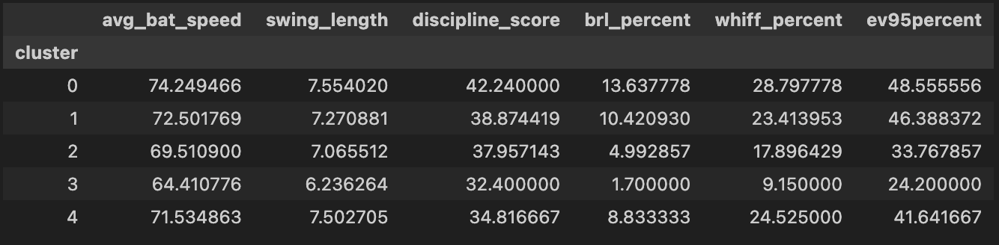
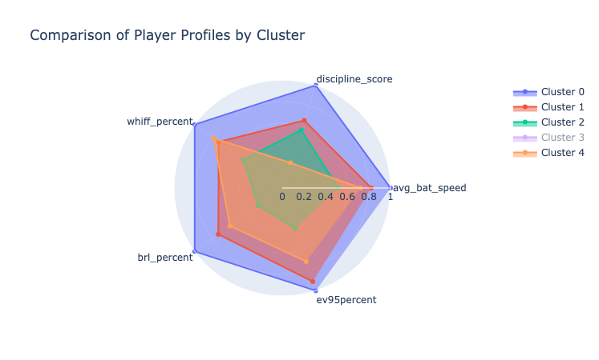
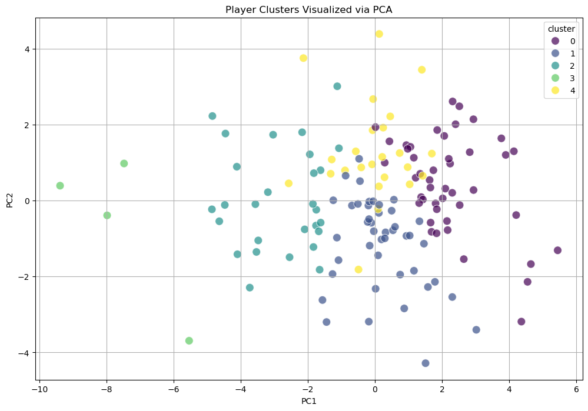
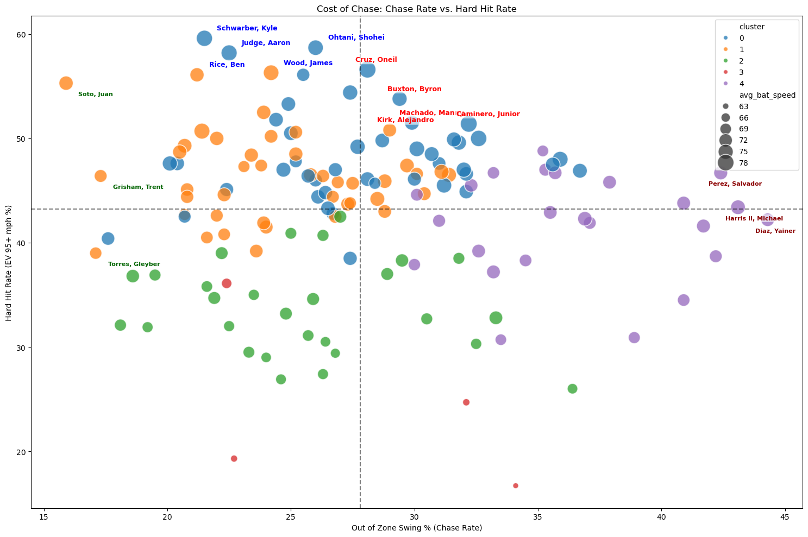
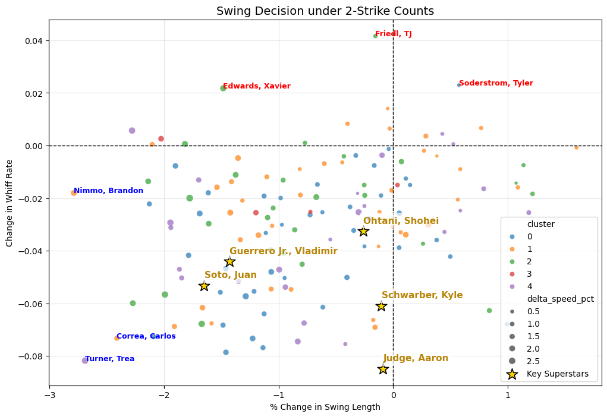
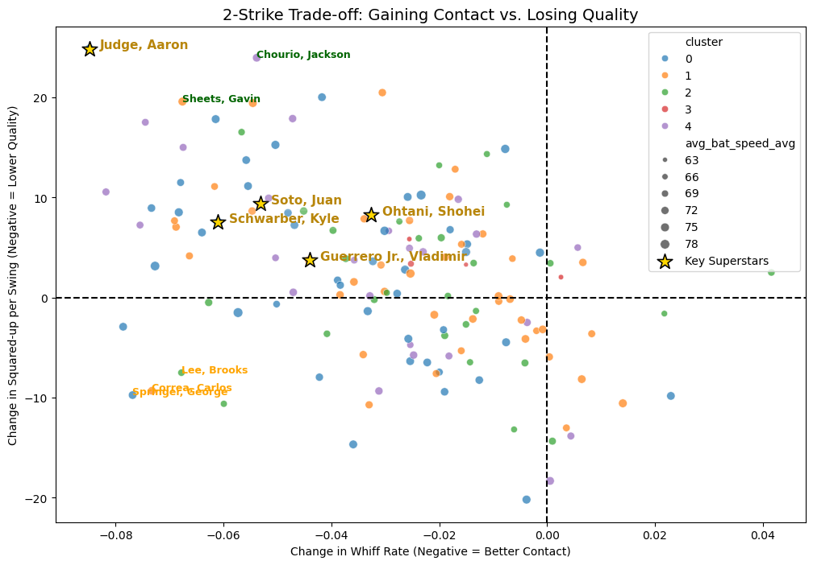

# 2025-MLB-Swing-Decision-Analysis

This project utilizes advanced MLB Statcast data to analyze and cluster Major League hitters based on their physical traits, plate discipline, and batted-ball quality. By integrating "Bat Tracking" metrics with "Swing Decisions," this research identifies distinct hitter archetypes and explores the strategic trade-offs between aggression and efficiency.

## 📊 Project Overview

Traditional baseball analytics often separate physical tools (Power) from mental approach (Discipline). This project bridges that gap by using Unsupervised Learning (K-Means) to profile hitters based on how their swing mechanics interact with their plate discipline.

## 🛠️ Data & Methodology

### Data Sources
The analysis integrates data from [**Baseball Savant (Statcast)**](https://baseballsavant.mlb.com/) and [**Baseball Reference**](https://www.baseball-reference.com/) for the 2025 season:
- **Bat Tracking**: Average Bat Speed, Swing Length, Squared-up %, and Blast %.
- **Exit Velocity & Barrels**: Hard Hit Rate (95+ mph), Barrel %, and Average EV.
- **Plate Discipline**: Zone Swing %, Out-of-Zone Swing % (Chase Rate), and Whiff %.

### Workflow
1. **ETL & Data Merging**: Aligning multi-source datasets via `player_id`.
2. **Feature Engineering**:
   - `Discipline Score`: Calculated as `Zone Swing % - Chase %` to measure strike zone judgment.
   - `Power Efficiency`: Ratio of `Average Exit Velocity` to `Bat Speed`.
   - `Chase Efficiency`: `Hard Hit Rate` relative to `Chase Rate` to measure the cost of aggression.
3. **Clustering**: Applied **K-Means Clustering** with the Elbow Method to identify 5 distinct hitter archetypes.
4. **Strategic Mapping**: Developed a 4-Quadrant Strategic Map to visualize the relationship between decision-making and physical output.

## 📈 Key Insights & Visualizations

### 1. Batter Archetype Analysis (Clustering)

Based on our K-Means clustering ($K=5$), the 144 qualified hitters were segmented into the following strategic groups:

| Cluster | Group Name | Characteristics | Representative Stars | Sample Size |
|:---:|:---|:---|:---|:---:|
| **0** | **The All-Around Elites** | Elite bat speed + High discipline + High impact; High Whiff% as a trade-off. | Shohei Ohtani, Aaron Judge, Kyle Schwarber | 45 |
| **1** | **Disciplined Power** | Strong power + Elite zone selection; significantly lower Whiff% than Cluster 0. | Juan Soto, Vladimir Guerrero Jr. | 43 |
| **2** | **Aggressive Swingers** | High bat speed; lower discipline scores; heavy reliance on raw physical tools. | Mookie Betts, Jake Cronenworth | 28 |
| **3** | **The Contact Machines** | Extreme bat control + Short swing path; prioritize "putting the ball in play" over power. | Luis Arraez, Steven Kwan | 4 |
| **4** | **Dynamic Multi-Tool** | Balanced output; value through situational hitting, versatility, and consistent contact. | Trea Turner, Bo Bichette, Salvador Perez | 24 |

---

While the X and Y axes of the PCA plot do not represent specific physical metrics, they serve as a 2D projection of the 13-dimensional hitter profiles. The clear separation of colors (clusters) validates that our K-Means model has successfully identified distinct, non-overlapping archetypes based on swing physics and plate discipline.

---

### 2. Cost of Chase: Chase Rate vs. Hard Hit Rate
By plotting decision quality against physical output, we identified four distinct quadrants. This visualization highlights how different hitter profiles navigate the trade-off between aggression and quality of contact.

- **ELITE (Patient & Powerful)**: Hitters like **Aaron Judge**, **Kyle Schwarber** and **Shohei Ohtani** exhibit elite plate discipline while maintaining the league's highest hard-hit rates.
- **AGGRESSIVE (Bad Ball Hitters)**: This group, including stars like **Manny Machado** and **Oniel Cruz**, possesses the rare physical ability to turn "bad balls" into high-velocity contact despite high chase rates.

---

### 3. The Art of Adjustment: 2-Strike Approach Analysis
This section analyzes how hitters modify their physical swing mechanics when facing a 2-strike count. By comparing season averages to 2-strike performance, we quantify the "survival instinct" of elite batters.

#### **I. Swing Shortening vs. Whiff Reduction**
Most MLB hitters adopt a defensive approach in 2-strike counts by shortening their swing path. This visualization tracks the effectiveness of this trade-off.

- **Tactical Adjusters**: Players in the bottom-left quadrant, like **Carlos Correa** and **Trea Turner**, significantly shorten their swing length to combat whiffs. This proves a high level of situational awareness and willingness to compromise power for contact.
- **The Natural Outliers**: Hitters like **Juan Soto** maintain a more consistent swing profile, relying on elite plate discipline rather than mechanical changes to survive deep counts.

#### **II. The Trade-off: Gaining Contact vs. Losing Quality**
The ultimate goal of a 2-strike adjustment is to reduce whiffs without catastrophic losses in hitting quality (Measured by `Squared-up per Swing`).

- **Monster Efficiency (The Judge Quadrant)**: **Aaron Judge** defies the standard trade-off. He resides in the **top-left quadrant**, meaning he successfully reduces his Whiff% while simultaneously *increasing* his Squared-up rate. This indicates superior bat control under pressure. Even after two strike, he strikes fear into every pitcher he faced.
- **Defensive Compromise**: In contrast, while many players reduce their whiff rates, they suffer a sharp decline in hitting quality (Bottom-left). This "Slapper" approach ensures the ball is put in play but with significantly less impact.
- **The All-Around Stars**: **Shohei Ohtani** and **Juan Soto** serve as benchmarks for elite stability, maintaining high-quality contact profiles even when adjusting for contact.

---

## 🚀 Key Takeaways & Conclusion

- **Model Validity**: The strong alignment between K-Means clusters and 2-strike adaptation patterns validates that our archetypes reflect real-world hitting philosophies.
- **The "Power vs. Contact" Spectrum**: From the extreme contact of **Luis Arraez** to the high-risk/high-reward profile of **Aaron Judge**, hitters navigate their physical limitations through tactical swing adjustments.
- **Strategic Value**: This analysis provides a framework for coaches and front offices to identify which hitters possess a "B-swing" for survival and which hitters remain aggressive regardless of the count.

---
*Created as a part of a personal Baseball Research & Analytics project.*
